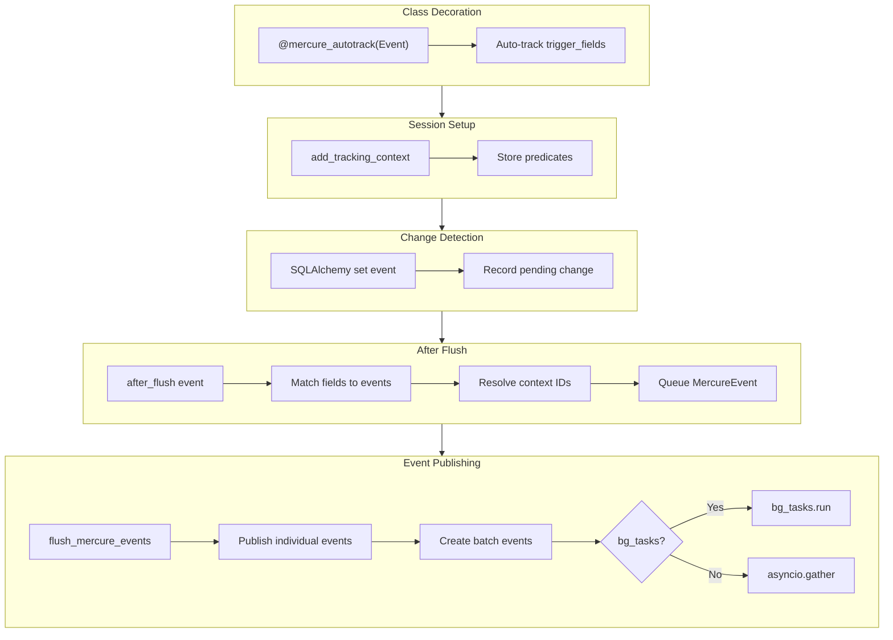

# Automatic Mercure Event Tracking via TrackedAsyncSession

## Architecture Overview



**Event Flow Example:**

```
OrderUpdateEvent(order_id="abc") queued
  ↓
flush_mercure_events():
  1. Publish OrderUpdateEvent to ["orders/abc"]
  2. Batch: ListUpdateEvent.from_collected([OrderUpdateEvent])
  3. Publish ListUpdateEvent(order_ids=["abc"]) to ["orders"]
```

## Key Design Decisions

1. **Event Class Hierarchy**:

                                                                                                                                                                                                                                                                                                                                                                                                                                                                                                                                                                                                                                                                                                                                                                                                                                                                                                                                                                                                                                                                                                                                                                                                                                                                                                                                                                                                                                                                                                                                                                                                                                                                                                                                                                                                                                                                                                                                                                                                                                                                                                                                                                                                                                                                                                                                                                                                                                                                                                                                                                                                                                                                                                                                                                                                                                                                                                                                                                                                                                                                                                                                                                                                - `BaseMercureEvent` - base class with just `get_topics()`
                                                                                                                                                                                                                                                                                                                                                                                                                                                                                                                                                                                                                                                                                                                                                                                                                                                                                                                                                                                                                                                                                                                                                                                                                                                                                                                                                                                                                                                                                                                                                                                                                                                                                                                                                                                                                                                                                                                                                                                                                                                                                                                                                                                                                                                                                                                                                                                                                                                                                                                                                                                                                                                                                                                                                                                                                                                                                                                                                                                                                                                                                                                                                                                                - `MercureEvent(BaseMercureEvent)` - adds `trigger_fields` for auto-tracking
                                                                                                                                                                                                                                                                                                                                                                                                                                                                                                                                                                                                                                                                                                                                                                                                                                                                                                                                                                                                                                                                                                                                                                                                                                                                                                                                                                                                                                                                                                                                                                                                                                                                                                                                                                                                                                                                                                                                                                                                                                                                                                                                                                                                                                                                                                                                                                                                                                                                                                                                                                                                                                                                                                                                                                                                                                                                                                                                                                                                                                                                                                                                                                                                - `BatchMercureEvent(BaseMercureEvent)` - adds `collect_events` for batching

2. **Typed Event Types**: Use `MercureEventType(StrEnum)` for `type` field - ensures compile-time safety and serializes to string in JSON
3. **Field-to-Event Mapping**: Each `MercureEvent` subclass declares which model fields trigger it - system auto-dispatches correct event
4. **Automatic Batching**: `BatchMercureEvent` subclasses declare `collect_events` - session auto-batches matching events
5. **Topic Separation**: Individual events publish to `orders/{id}`, batch events publish to `orders`
6. **Protocol + Decorator**: `@mercure_autotrack(Event)` decorator with `MercureTrackable` Protocol for compile-time enforcement
7. **Type-Safe Predicates**: `add_tracking_context(*predicates: ColumnElement[bool])` accepts only SQLAlchemy predicates
8. **Simplified MercurePublishService**: Single `publish(event)` method - events know their topics
9. **Smart bg_tasks Handling**: Session handles both background (via `bg_tasks.run()`) and direct (`asyncio.gather()`) publishing
10. **Commit-Time Publishing**: Events collected during `after_flush`, published after `commit()` to ensure frontend sees committed data

---

## File Changes

### 1. New: `app/db/tracked_session.py`

Core session extension with tracking capabilities:

```python
from sqlalchemy.sql.elements import ColumnElement

class TrackedAsyncSession(AsyncSession):
    """AsyncSession with automatic Mercure event tracking."""
    
    _bg_tasks: BackgroundTasks | None
    _mercure_service: MercurePublishService
    _tracked_fields: set[InstrumentedAttribute]
    _context_predicates: list[ColumnElement[bool]]
    _pending_changes: set[InstrumentedAttribute]
    _pending_events: list[MercureEvent]  # Events to publish after flush
    
    def track_changes(self, *fields: InstrumentedAttribute) -> Self:
        """Register fields to watch for changes.
        
        Usage:
            session.track_changes(ColoringVersion.status)
            session.track_changes(ColoringVersion.status, Image.selected_svg_id)
        """
        ...
    
    def add_tracking_context(self, *predicates: ColumnElement[bool]) -> Self:
        """Add context predicates for resolving event fields.
        
        Predicates identify which records are being tracked. The system uses
        these to resolve order_id and image_id for Mercure events.
        
        Usage:
            session.add_tracking_context(ColoringVersion.id == version_id)
            session.add_tracking_context(Image.id == image_id, Order.id == order_id)
        """
        ...
    
    async def commit(self) -> None:
        """Commit transaction and publish Mercure events.
        
        Events are collected during after_flush hooks, but only published
        AFTER commit to ensure frontend sees committed data.
        """
        await super().commit()
        await self._flush_mercure_events()
    
    async def _flush_mercure_events(self) -> None:
        """Publish all pending Mercure events with automatic batching.
        
        Called automatically by commit(). Do not call directly.
        
        1. Publishes individual events to their specific topics
        2. Creates batch events from collected events via BATCH_EVENT_REGISTRY
        3. Uses bg_tasks if available, otherwise asyncio.gather
        """
        if not self._pending_events:
            return
        
        # Import registries (no specific event classes imported here)
        from app.services.mercure.events import BATCH_EVENT_REGISTRY
        
        # Collect events for each batch type
        collected: dict[type, list] = {cls: [] for cls in BATCH_EVENT_REGISTRY}
        
        events_to_publish: list = []
        
        for event in self._pending_events:
            # Check if this event should be collected by a batch
            for batch_cls in BATCH_EVENT_REGISTRY:
                if type(event) in batch_cls.collect_events:
                    collected[batch_cls].append(event)
                    break
            
            # Always publish individual event to its specific topics
            events_to_publish.append(event)
        
        # Create batch events from collected events
        for batch_cls, events in collected.items():
            if events:
                batch_event = batch_cls.from_collected(events)
                if batch_event is not None:
                    events_to_publish.append(batch_event)
        
        # Publish all events
        coros = [self._mercure_service.publish(e) for e in events_to_publish]
        
        if self._bg_tasks:
            # Non-blocking: schedule via BackgroundTasks
            for coro in coros:
                self._bg_tasks.run(coro)
        else:
            # Blocking: await all directly
            await asyncio.gather(*coros, return_exceptions=True)
        
        self._pending_events.clear()
```

### 1b. New: `app/db/mercure_protocol.py`

Protocol and decorator for compile-time enforcement:

```python
from typing import Protocol, TypeVar, runtime_checkable

from app.db.tracked_session import TrackedAsyncSession
from app.services.mercure.events import MercureEvent


@runtime_checkable
class MercureTrackable(Protocol):
    """Protocol for services that support Mercure auto-tracking.
    
    Classes decorated with @mercure_autotrack must have this attribute.
    Enforced at compile-time by mypy/pyright.
    """
    session: TrackedAsyncSession


T = TypeVar("T", bound=MercureTrackable)


def mercure_autotrack(*event_classes: type[MercureEvent]):
    """Class decorator that enables automatic Mercure event tracking.
    
    Automatically tracks all trigger_fields from the specified event classes.
    Requires the class to have a `session: TrackedAsyncSession` attribute.
    
    Usage:
        @mercure_autotrack(ImageUpdateEvent)
        class ColoringGenerationService:
            def __init__(self, session: TrackedAsyncSession, ...):
                self.session = session
    """
    def decorator(cls: type[T]) -> type[T]:
        # Collect all trigger fields from specified events
        all_trigger_fields: set[InstrumentedAttribute] = set()
        for event_cls in event_classes:
            all_trigger_fields.update(event_cls.trigger_fields)
        
        # Store on class for introspection
        cls._mercure_events = event_classes  # type: ignore
        cls._mercure_trigger_fields = frozenset(all_trigger_fields)  # type: ignore
        
        # Wrap __init__ to auto-register tracking
        original_init = cls.__init__
        
        def new_init(self: T, *args, **kwargs) -> None:
            original_init(self, *args, **kwargs)
            # Auto-track all trigger fields for specified events
            if hasattr(self, 'session') and all_trigger_fields:
                self.session.track_changes(*all_trigger_fields)
        
        cls.__init__ = new_init  # type: ignore
        return cls
    
    return decorator
```

**Compile-time enforcement**: If a class decorated with `@mercure_autotrack` doesn't have `session: TrackedAsyncSession`, mypy/pyright will error.

### 2. Move and refactor: `app/services/mercure/events.py`

Events moved from `app/models/events.py` to `app/services/mercure/events.py` with class hierarchy:

```python
"""Mercure event definitions with tracking metadata."""

from enum import StrEnum
from typing import ClassVar, Self

from pydantic import BaseModel
from sqlalchemy.orm import InstrumentedAttribute

from app.models.coloring import ColoringVersion, SvgVersion
from app.models.order import Image, Order


class MercureEventType(StrEnum):
    """Mercure event types - serializes to string value in JSON."""
    ORDER_UPDATE = "order_update"
    LIST_UPDATE = "list_update"
    IMAGE_UPDATE = "image_update"


# =============================================================================
# Base Classes
# =============================================================================

class BaseMercureEvent(BaseModel):
    """Base class for all Mercure events.
    
    Defines common interface:
 - type: MercureEventType enum value
 - get_topics(): Returns Mercure topics for publishing
    """
    
    def get_topics(self) -> list[str]:
        """Return Mercure topics for this event."""
        raise NotImplementedError


class MercureEvent(BaseMercureEvent):
    """Event that can be auto-triggered by model field changes.
    
    Subclasses define:
 - trigger_fields: ClassVar of fields that trigger this event
 - required_context: ClassVar of fields needed to construct the event
    """
    
    trigger_fields: ClassVar[frozenset[InstrumentedAttribute]]
    required_context: ClassVar[tuple[InstrumentedAttribute, ...]]


class BatchMercureEvent(BaseMercureEvent):
    """Event that collects/batches other events.
    
    When flush_mercure_events runs:
 1. Finds all events matching `collect_events` types
 2. Calls `from_collected()` to create the batched event
 3. Publishes batch to its topics (individual events still publish to their topics)
    """
    
    collect_events: ClassVar[tuple[type[BaseMercureEvent], ...]] = ()
    
    @classmethod
    def from_collected(cls, events: list[BaseMercureEvent]) -> Self | None:
        """Create batched event from collected events.
        
        Returns None if no batch should be published.
        """
        raise NotImplementedError


# =============================================================================
# Concrete Events
# =============================================================================

class OrderUpdateEvent(MercureEvent):
    """Event for order-level changes (status, metadata).
    
    Published to order-specific topic only. ListUpdateEvent batches these
    for the "orders" topic.
    """
    
    type: MercureEventType = MercureEventType.ORDER_UPDATE
    order_id: str
    
    trigger_fields: ClassVar[frozenset[InstrumentedAttribute]] = frozenset({
        Order.status,
    })
    required_context: ClassVar[tuple[InstrumentedAttribute, ...]] = (Order.id,)
    
    def get_topics(self) -> list[str]:
        # Only order-specific topic - ListUpdateEvent handles "orders" topic
        return [f"orders/{self.order_id}"]


class ImageUpdateEvent(MercureEvent):
    """Event for image-level changes (processing status, selection).
    
    Published to order-specific topic only. Frontend refetches full image data.
    Not batched into ListUpdateEvent (images not shown in list view).
    """
    
    type: MercureEventType = MercureEventType.IMAGE_UPDATE
    order_id: str
    image_id: int
    
    trigger_fields: ClassVar[frozenset[InstrumentedAttribute]] = frozenset({
        ColoringVersion.status,
        SvgVersion.status,
        Image.selected_coloring_id,
        Image.selected_svg_id,
    })
    required_context: ClassVar[tuple[InstrumentedAttribute, ...]] = (Order.id, Image.id)
    
    def get_topics(self) -> list[str]:
        # Only order-specific topic
        return [f"orders/{self.order_id}"]


class ListUpdateEvent(BatchMercureEvent):
    """Batched event for order list updates.
    
    Collects OrderUpdateEvent instances and publishes once to "orders" topic.
 - order_ids populated → targeted refresh for specific orders
 - order_ids empty → full refresh (manual trigger, additions/deletions)
    
    Note: Does NOT collect ImageUpdateEvent (images not shown in list view).
    """
    
    type: MercureEventType = MercureEventType.LIST_UPDATE
    order_ids: list[str] = []
    
    # Only collect OrderUpdateEvent - images not shown in list view
    collect_events: ClassVar[tuple[type[BaseMercureEvent], ...]] = (
        OrderUpdateEvent,
    )
    
    def get_topics(self) -> list[str]:
        return ["orders"]
    
    @classmethod
    def from_collected(cls, events: list[BaseMercureEvent]) -> Self | None:
        """Create batched list update from collected OrderUpdateEvents."""
        if not events:
            return None
        
        # Extract unique order_ids
        order_ids: set[str] = set()
        for event in events:
            if isinstance(event, OrderUpdateEvent):
                order_ids.add(event.order_id)
        
        if not order_ids:
            return None
        
        return cls(order_ids=sorted(order_ids))


# =============================================================================
# Registries
# =============================================================================

# Union for API schema exposure
MercureEventUnion = OrderUpdateEvent | ListUpdateEvent | ImageUpdateEvent

# Events with trigger_fields for auto-tracking
EVENT_REGISTRY: list[type[MercureEvent]] = [
    OrderUpdateEvent,
    ImageUpdateEvent,
]

# Batch events for flush_mercure_events logic
BATCH_EVENT_REGISTRY: list[type[BatchMercureEvent]] = [
    ListUpdateEvent,
]
```

Key improvements:

- **`BaseMercureEvent`**: Base class with just `get_topics()` - no trigger_fields
- **`MercureEvent(BaseMercureEvent)`**: Adds `trigger_fields` and `required_context` for auto-tracking
- **`BatchMercureEvent(BaseMercureEvent)`**: Adds `collect_events` and `from_collected()` for batching
- **`MercureEventType` StrEnum**: Typed enum that serializes to string in JSON
- **`OrderUpdateEvent` topics**: Only `orders/{id}` - no longer publishes to `orders`
- **`ImageUpdateEvent` topics**: Only `orders/{id}` - no longer publishes to `orders`
- **`ListUpdateEvent`**: Collects only `OrderUpdateEvent` (not `ImageUpdateEvent`) since images aren't in list view
- **`MercureEventUnion`**: Union type for API schema exposure
- **Dual registries**: `EVENT_REGISTRY` for auto-tracking, `BATCH_EVENT_REGISTRY` for batching

### 2b. Update: `app/api/v1/events/routes.py`

Update import to use new location:

```python
"""Events API routes - exposes event schema for frontend type generation."""

from fastapi import APIRouter

from app.services.mercure.events import MercureEventUnion

router = APIRouter(tags=["events"])


@router.get(
    "/events/schema",
    response_model=MercureEventUnion,
    operation_id="getMercureEventSchema",
    include_in_schema=True,
    summary="Mercure event schema (for documentation only)",
)
async def get_event_schema() -> None:
    """This endpoint exists only to expose event types in OpenAPI schema."""
    raise NotImplementedError("This endpoint is for schema documentation only")
```

### 2c. Delete: `app/models/events.py`

Remove the old file after migration is complete.

### 3. Refactor: `app/services/mercure/publish_service.py`

Simplified service with single `publish()` method:

```python
from app.services.mercure.events import MercureEvent

class MercurePublishService:
    """Service for publishing events to Mercure hub."""

    def _create_jwt(self) -> str:
        """Create a JWT token for publishing to Mercure."""
        return jwt.encode(
            {"mercure": {"publish": ["*"]}},
            settings.mercure_publisher_jwt_key,
            algorithm="HS256",
        )

    async def publish(self, event: MercureEvent) -> None:
        """Publish any Mercure event.
        
        The event knows its own topics via get_topics().
        """
        if not settings.mercure_publisher_jwt_key:
            logger.warning("Mercure publisher JWT key not configured, skipping publish")
            return

        topics = event.get_topics()
        token = self._create_jwt()

        async with httpx.AsyncClient() as client:
            try:
                data = {
                    "topic": topics,
                    "data": event.model_dump_json(),
                }
                response = await client.post(
                    settings.mercure_url,
                    data=data,
                    headers={"Authorization": f"Bearer {token}"},
                    timeout=5.0,
                )
                response.raise_for_status()
                logger.debug("Published Mercure event", topics=topics, type=event.type)
            except Exception as e:
                logger.error("Failed to publish Mercure event", error=str(e), topics=topics)
```

Old methods (`publish_order_update`, `publish_image_update`, etc.) are removed - callers construct events directly:

```python
# Before
await mercure.publish_order_update(order_id)

# After
await mercure.publish(OrderUpdateEvent(order_id=order_id))
```

### 5. New: `app/db/context_resolver.py`

Resolves context fields (order_id, image_id) from tracked model predicates:

```python
# Relationship paths from various models to Order and Image
RELATIONSHIP_PATHS: dict[tuple[type, type], list[str]] = {
    # ColoringVersion -> Image (direct FK)
    (ColoringVersion, Image): ["image_id"],
    # ColoringVersion -> Order (via Image -> LineItem -> Order)
    (ColoringVersion, Order): ["image_id", "line_item_id", "order_id"],
    # SvgVersion -> Image
    (SvgVersion, Image): ["image_id"],
    # SvgVersion -> Order
    (SvgVersion, Order): ["image_id", "line_item_id", "order_id"],
    # Image -> Order
    (Image, Order): ["line_item_id", "order_id"],
}

class ContextResolver:
    """Resolves required context fields from tracked model predicates."""
    
    def resolve_sync(
        self,
        predicates: list[ColumnElement[bool]],
        required: tuple[InstrumentedAttribute, ...],
    ) -> dict[str, Any] | None:
        """Resolve context synchronously from predicates.
        
        Returns dict mapping field names to values, or None if incomplete.
        Uses values extracted from predicates + relationship traversal.
        """
        ...
```

### 6. Update: `app/db.py`

Modify session factory to support TrackedAsyncSession:

```python
from app.db.tracked_session import TrackedAsyncSession

async_session_maker = async_sessionmaker(
    engine,
    class_=TrackedAsyncSession,
    expire_on_commit=False,
)
```

### 7. Update: `app/tasks/utils/task_db.py`

Pass `bg_tasks` and `mercure_service` to session:

```python
@asynccontextmanager
async def task_db_session(
    bg_tasks: BackgroundTasks | None = None,
    mercure_service: MercurePublishService | None = None,
) -> AsyncGenerator[TrackedAsyncSession]:
    ...
    session_maker = async_sessionmaker(
        engine,
        class_=TrackedAsyncSession,
        expire_on_commit=False,
    )
    async with session_maker() as session:
        session._bg_tasks = bg_tasks
        session._mercure_service = mercure_service or MercurePublishService()
        ...
```

### 8. Update: `app/services/coloring/coloring_generation_service.py`

Simplified service with decorator-based tracking:

```python
from app.db.mercure_protocol import mercure_autotrack
from app.db.tracked_session import TrackedAsyncSession
from app.services.mercure.events import ImageUpdateEvent


@mercure_autotrack(ImageUpdateEvent)
class ColoringGenerationService:
    """Service for coloring generation via RunPod.
    
    @mercure_autotrack automatically tracks: ColoringVersion.status,
    SvgVersion.status, Image.selected_coloring_id, Image.selected_svg_id
    """
    
    session: TrackedAsyncSession  # Required by MercureTrackable protocol
    
    def __init__(
        self,
        session: TrackedAsyncSession,
        storage: S3StorageService,
        runpod: RunPodService,
        # No longer needs mercure_service or bg_tasks - session handles it
    ):
        self.session = session
        self.storage = storage
        self.runpod = runpod

    async def process(self, coloring_version_id: int, ...) -> None:
        # Only need to provide context - tracking is automatic from decorator
        self.session.add_tracking_context(ColoringVersion.id == coloring_version_id)
        
        # All status updates now auto-publish!
        async with locker.acquire() as lock:
            await lock.update_record(status=PROCESSING)  # Auto-tracked
        
        # Add more context as we load relationships
        image = await self.session.get(Image, image_id)
        self.session.add_tracking_context(Image.id == image.id)
        
        order = await self.session.get(Order, line_item.order_id)
        self.session.add_tracking_context(Order.id == order.id)
        
        # Subsequent status changes have full context
        # No manual mercure.publish() calls needed
```

**Compile-time safety**: If `session` attribute is missing or has wrong type, mypy/pyright will error.

### 9. Update: `app/tasks/coloring/generate_coloring.py`

Simplified task that passes dependencies to session:

```python
@background_tasks(timeout=30)
async def _generate_coloring_async(
    coloring_version_id: int,
    *,
    is_recovery: bool = False,
    bg_tasks: BackgroundTasks,
) -> None:
    mercure = MercurePublishService()
    
    async with task_db_session(bg_tasks=bg_tasks, mercure_service=mercure) as session:
        service = ColoringGenerationService(
            session=session,
            storage=S3StorageService(),
            runpod=RunPodService(),
        )
        await service.process(coloring_version_id, is_recovery=is_recovery)
```

### 10. Update: `app/tasks/orders/order_ingestion.py`

Example usage for order-level tracking (without decorator for simple tasks):

```python
async def _ingest_order_async(order_id: str) -> None:
    # No bg_tasks → events are awaited directly via asyncio.gather
    async with task_db_session() as session:
        order = await session.get(Order, order_id)
        if not order:
            return
        
        # Track Order.status changes → triggers OrderUpdateEvent
        session.track_changes(Order.status).add_tracking_context(Order.id == order_id)
        
        # Status changes auto-publish!
        order.status = OrderStatus.PROCESSING
        await session.commit()  # → queues OrderUpdateEvent
        await session.flush_mercure_events()  # → publishes via asyncio.gather
        
        # ... sync logic ...
        
        order.status = OrderStatus.READY_FOR_REVIEW
        await session.commit()  # → queues OrderUpdateEvent
        await session.flush_mercure_events()  # → publishes via asyncio.gather
```

Or with decorator for service classes:

```python
@mercure_autotrack(OrderUpdateEvent)
class OrderIngestionService:
    session: TrackedAsyncSession
    
    def __init__(self, session: TrackedAsyncSession):
        self.session = session
    
    async def ingest(self, order_id: str) -> None:
        # Order.status tracking is automatic from decorator
        self.session.add_tracking_context(Order.id == order_id)
        # ...
```

---

## SQLAlchemy Event Integration

Register attribute listeners when `track_changes()` is called:

```python
def track_changes(self, *fields: InstrumentedAttribute) -> Self:
    for field in fields:
        if field not in self._tracked_fields:
            self._tracked_fields.add(field)
            # Register listener for this field
            event.listen(field, "set", self._on_field_change, propagate=True)
    return self

def _on_field_change(self, target, value, oldvalue, initiator) -> None:
    if value != oldvalue:
        self._pending_changes.add(initiator.parent_token)
```

Hook into `after_flush` to determine and publish correct events:

```python
from app.services.mercure.events import EVENT_REGISTRY, MercureEvent

@event.listens_for(TrackedAsyncSession, "after_flush")
def _after_flush(session: TrackedAsyncSession, flush_context) -> None:
    if not session._pending_changes:
        return
    
    # Find which event types to dispatch based on changed fields
    events_to_publish: set[type[MercureEvent]] = set()
    
    for changed_field in session._pending_changes:
        for event_cls in EVENT_REGISTRY:
            if changed_field in event_cls.trigger_fields:
                events_to_publish.add(event_cls)
    
    # Resolve context and publish each event type
    for event_cls in events_to_publish:
        session._schedule_event_publish(event_cls)
    
    session._pending_changes.clear()


def _schedule_event_publish(self, event_cls: type[MercureEvent]) -> None:
    """Resolve context and queue event for publishing."""
    # Resolve required context (order_id, image_id, etc.)
    context = self._resolver.resolve_sync(
        self._context_predicates,
        event_cls.required_context,
    )
    
    if context is None:
        logger.warning(
            "Cannot publish event - incomplete context",
            event_type=event_cls.__name__,
        )
        return
    
    # Construct event instance and queue for publishing
    event = event_cls(**context)
    self._pending_events.append(event)
    # Events are published in flush_mercure_events() after commit
```

This ensures:

- `Order.status` change → `OrderUpdateEvent` (requires: `order_id`)
- `ColoringVersion.status` change → `ImageUpdateEvent` (requires: `order_id`, `image_id`)
- `SvgVersion.status` change → `ImageUpdateEvent` (requires: `order_id`, `image_id`)
- `Image.selected_coloring_id` change → `ImageUpdateEvent` (requires: `order_id`, `image_id`)
- `Image.selected_svg_id` change → `ImageUpdateEvent` (requires: `order_id`, `image_id`)

---

## Frontend Changes

### Update: `frontend/src/hooks/useOrderListEvents.ts`

Handle the new `ListUpdateEvent.order_ids` field:

```typescript
const handleMessage = useCallback((data: unknown) => {
  const event = data as MercureEvent;
  console.log("[Mercure] Order list event received:", event);

  if (event.type === "list_update") {
    // ListUpdateEvent now has order_ids for targeted refresh
    if (event.order_ids && event.order_ids.length > 0) {
      // Targeted refresh: invalidate specific orders
      for (const orderId of event.order_ids) {
        queryClient.invalidateQueries({ queryKey: getGetOrderQueryKey(orderId) });
      }
    }
    // Always refresh the list
    queryClient.invalidateQueries({ queryKey: getListOrdersQueryKey() });
  } else if (event.type === "image_status" || event.type === "image_update") {
    // Image events don't affect list view
    return;
  } else if (event.type === "order_update") {
    // This should no longer be received on "orders" topic
    // (now only published to "orders/{id}")
    // Keep for backward compatibility during migration
    queryClient.invalidateQueries({ queryKey: getListOrdersQueryKey() });
    queryClient.invalidateQueries({ queryKey: getGetOrderQueryKey(event.order_id) });
  }
}, []);
```

**Schema change**: `ListUpdateEvent` now includes optional `order_ids: string[]` field (generated via Orval).

---

## Files to Delete/Deprecate

- `app/models/events.py` - Moved to `app/services/mercure/events.py`
- `app/services/mercure/contexts.py` - Replaced by automatic tracking via TrackedAsyncSession

---

## Migration Strategy

1. Implement new tracking system alongside existing manual approach
2. Migrate services one by one (start with `ColoringGenerationService`)
3. Keep `MercurePublishService` for direct publish needs (webhooks, API routes)
4. Remove manual `mercure.publish()` calls as services are migrated