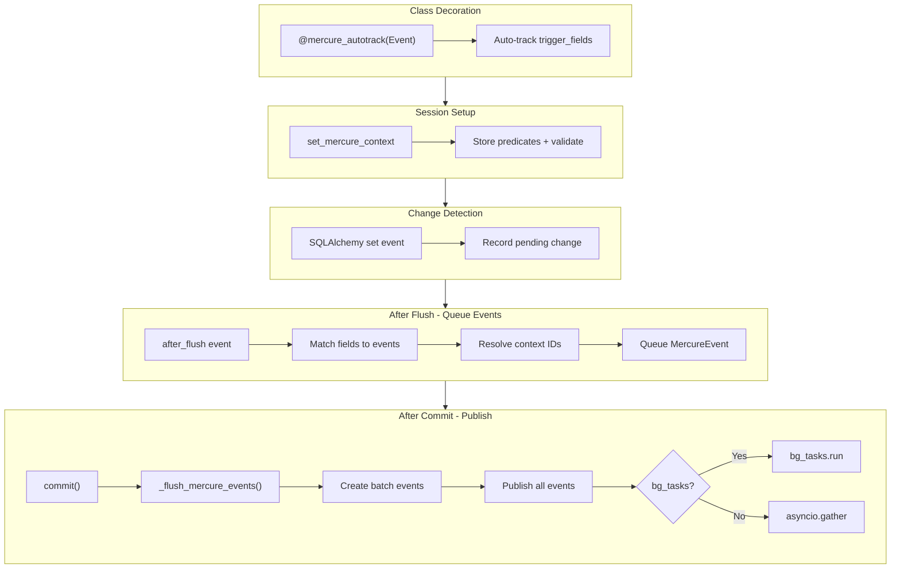

# Automatic Mercure Event Tracking via TrackedAsyncSession

## Architecture Overview



**Event Flow Example:**

```
1. Service modifies Order.status
2. after_flush: Queue OrderUpdateEvent(order_id="abc")
3. commit() completes transaction
4. _flush_mercure_events() runs:
   - Publish OrderUpdateEvent to ["orders/abc"]
   - Batch: ListUpdateEvent.from_collected([OrderUpdateEvent])
   - Publish ListUpdateEvent(order_ids=["abc"]) to ["orders"]
```

## Key Design Decisions

1. **Event Class Hierarchy**:

                                                                                                                                                                                                                                                                                                                                                                                                                                                                                                                                                                                                                                                                                                                                                                                                                                                                                                                                                                                                                                                                                                                                                                                                                                                                                                                                                                                                                                                                                                                                                                                                                                                                                                                                                                                                                                                                                                                                                                                                                                                                                                                                                                                                                                                                                                                                                                                                                                                                                                                                                                                                                                                                                                                                                                                                                                                                                                                                                                                                                                                                                                                                                                                                                                                                                                                                                                                                                                                                                                                                                                                                                                                                                                                                                                                                                                                                                                                                                                                                                                                                                                                                                                                                                                                                                                                                                                                                                                                                                                                                                                                                                                                                                                                                                                                                                                                                                                                                                                                                                                                                                                                                                                                                                                                                                                                                                                                                                                                                                                                                                                                                                                                                                                                                                                                                                                                                                                                                                                                                                                                                                                                                                                                                                                                                                                                                                                                                                                                                                                                                                                                                                                                                                                                                                                                                                                                                                                                                                                                                                                                                                                                                                                                                                                                                                                                                                                                                                                                                                                                                                                                                                                                                                                                                                                                                                                                                                                                                                                                                                                                                                                                                                                                                                                                                                                                                                                                                                                                                                                                                                                                                                                                                                                                                                                                                                                                                                                                                                                                                                                                                                                                                                                                                                                                                                                                                                                                                                                                                                                                                                                                                                                                                                                                                                                                                                                                                                                                                                                                                                                                                                                                                                                                                                                                                                                                                                                                                                                                                                                                                                                                                                                                                                                                                                                                                                                                                                                                                                                                                                                                                                                                                                                                                                                                                                                                                                                                                                                                                                                                                                                                                                                                                                                                                                                                                                                                                                                                                                                                                                                                                                                                                                                                                                                                                                                                                                                                                                                                                                                                                                                                                                                                                                                                                                                                                - `BaseMercureEvent` - base class with just `get_topics()`
                                                                                                                                                                                                                                                                                                                                                                                                                                                                                                                                                                                                                                                                                                                                                                                                                                                                                                                                                                                                                                                                                                                                                                                                                                                                                                                                                                                                                                                                                                                                                                                                                                                                                                                                                                                                                                                                                                                                                                                                                                                                                                                                                                                                                                                                                                                                                                                                                                                                                                                                                                                                                                                                                                                                                                                                                                                                                                                                                                                                                                                                                                                                                                                                                                                                                                                                                                                                                                                                                                                                                                                                                                                                                                                                                                                                                                                                                                                                                                                                                                                                                                                                                                                                                                                                                                                                                                                                                                                                                                                                                                                                                                                                                                                                                                                                                                                                                                                                                                                                                                                                                                                                                                                                                                                                                                                                                                                                                                                                                                                                                                                                                                                                                                                                                                                                                                                                                                                                                                                                                                                                                                                                                                                                                                                                                                                                                                                                                                                                                                                                                                                                                                                                                                                                                                                                                                                                                                                                                                                                                                                                                                                                                                                                                                                                                                                                                                                                                                                                                                                                                                                                                                                                                                                                                                                                                                                                                                                                                                                                                                                                                                                                                                                                                                                                                                                                                                                                                                                                                                                                                                                                                                                                                                                                                                                                                                                                                                                                                                                                                                                                                                                                                                                                                                                                                                                                                                                                                                                                                                                                                                                                                                                                                                                                                                                                                                                                                                                                                                                                                                                                                                                                                                                                                                                                                                                                                                                                                                                                                                                                                                                                                                                                                                                                                                                                                                                                                                                                                                                                                                                                                                                                                                                                                                                                                                                                                                                                                                                                                                                                                                                                                                                                                                                                                                                                                                                                                                                                                                                                                                                                                                                                                                                                                                                                                                                                                                                                                                                                                                                                                                                                                                                                                                                                                                                                - `MercureEvent(BaseMercureEvent)` - adds `trigger_fields` for auto-tracking
                                                                                                                                                                                                                                                                                                                                                                                                                                                                                                                                                                                                                                                                                                                                                                                                                                                                                                                                                                                                                                                                                                                                                                                                                                                                                                                                                                                                                                                                                                                                                                                                                                                                                                                                                                                                                                                                                                                                                                                                                                                                                                                                                                                                                                                                                                                                                                                                                                                                                                                                                                                                                                                                                                                                                                                                                                                                                                                                                                                                                                                                                                                                                                                                                                                                                                                                                                                                                                                                                                                                                                                                                                                                                                                                                                                                                                                                                                                                                                                                                                                                                                                                                                                                                                                                                                                                                                                                                                                                                                                                                                                                                                                                                                                                                                                                                                                                                                                                                                                                                                                                                                                                                                                                                                                                                                                                                                                                                                                                                                                                                                                                                                                                                                                                                                                                                                                                                                                                                                                                                                                                                                                                                                                                                                                                                                                                                                                                                                                                                                                                                                                                                                                                                                                                                                                                                                                                                                                                                                                                                                                                                                                                                                                                                                                                                                                                                                                                                                                                                                                                                                                                                                                                                                                                                                                                                                                                                                                                                                                                                                                                                                                                                                                                                                                                                                                                                                                                                                                                                                                                                                                                                                                                                                                                                                                                                                                                                                                                                                                                                                                                                                                                                                                                                                                                                                                                                                                                                                                                                                                                                                                                                                                                                                                                                                                                                                                                                                                                                                                                                                                                                                                                                                                                                                                                                                                                                                                                                                                                                                                                                                                                                                                                                                                                                                                                                                                                                                                                                                                                                                                                                                                                                                                                                                                                                                                                                                                                                                                                                                                                                                                                                                                                                                                                                                                                                                                                                                                                                                                                                                                                                                                                                                                                                                                                                                                                                                                                                                                                                                                                                                                                                                                                                                                                                                                                - `BatchMercureEvent(BaseMercureEvent)` - adds `collect_events` for batching

2. **Typed Event Types**: Use `MercureEventType(StrEnum)` for `type` field - ensures compile-time safety and serializes to string in JSON
3. **Field-to-Event Mapping**: Each `MercureEvent` subclass declares which model fields trigger it - system auto-dispatches correct event
4. **Automatic Batching**: `BatchMercureEvent` subclasses declare `collect_events` - session auto-batches matching events
5. **Topic Separation**: Individual events publish to `orders/{id}`, batch events publish to `orders`
6. **Protocol + Decorator**: `@mercure_autotrack(Event)` decorator with `MercureTrackable` Protocol for compile-time enforcement
7. **Auto-Derived Required Context**: Decorator computes required fields from `Event.required_context` - no manual specification needed
8. **Dev-Time Context Validation**: `set_mercure_context()` validates against auto-derived required fields, raises `MercureContextError` if missing
9. **Dev-Time Missing Context Protection**: Tracked field changes without `set_mercure_context()` call raise `MercureContextError` immediately
10. **Simplified MercurePublishService**: Single `publish(event)` method - events know their topics
11. **Smart bg_tasks Handling**: Session handles both background (via `bg_tasks.run()`) and direct (`asyncio.gather()`) publishing
12. **Commit-Time Publishing**: Events collected during `after_flush`, published after `commit()` to ensure frontend sees committed data
13. **Direct Context Passing**: Tasks receive `order_id` and `image_id` as parameters - no `RELATIONSHIP_PATHS` or complex traversal needed
14. **Internal Error Handling**: Services handle errors internally (`_mark_error()` private). Single public entry point (`process()`) sets context first, handles all errors. Tasks don't call error methods directly.

---

## File Changes

### 1. New: `app/db/tracked_session.py`

Core session extension with tracking capabilities:

```python
from sqlalchemy.sql.elements import ColumnElement

class TrackedAsyncSession(AsyncSession):
    """AsyncSession with automatic Mercure event tracking."""
    
    _bg_tasks: BackgroundTasks | None
    _mercure_service: MercurePublishService
    _tracked_fields: set[InstrumentedAttribute]
    _context_predicates: list[ColumnElement[bool]]
    _pending_changes: set[InstrumentedAttribute]
    _pending_events: list[MercureEvent]  # Events to publish after flush
    
    _context_set: bool = False  # Flag to detect missing set_mercure_context calls
    _required_context_fields: frozenset[str] = frozenset()  # Set by @mercure_autotrack decorator
    
    def track_changes(self, *fields: InstrumentedAttribute) -> Self:
        """Register fields to watch for changes.
        
        Usage:
            session.track_changes(ColoringVersion.status)
            session.track_changes(ColoringVersion.status, Image.selected_svg_id)
        """
        ...
    
    def _set_required_context(self, required_fields: frozenset[str]) -> None:
        """Set required context fields. Called by @mercure_autotrack decorator.
        
        These fields will be validated when set_mercure_context() is called.
        """
        self._required_context_fields = required_fields
    
    def set_mercure_context(self, *predicates: ColumnElement[bool]) -> Self:
        """Set context for Mercure event publishing. Must be called at start of service methods.
        
        Args:
            *predicates: SQLAlchemy predicates like Order.id == order_id, Image.id == image_id
        
        Raises:
            MercureContextError: If required context fields (set by @mercure_autotrack)
                                 cannot be extracted from predicates
        
        Usage:
            # In a service decorated with @mercure_autotrack(ImageUpdateEvent)
            # ImageUpdateEvent.required_context = (Order.id, Image.id)
            # So this call must provide both order_id and image_id
            session.set_mercure_context(Order.id == order_id, Image.id == image_id)
        """
        self._context_predicates.extend(predicates)
        self._context_set = True
        
        # Validate required context is present (required fields set by decorator)
        if self._required_context_fields:
            context = self._extract_context()
            missing = self._required_context_fields - set(context.keys())
            if missing:
                raise MercureContextError(
                    f"Required Mercure context fields missing: {missing}. "
                    f"Ensure predicates include: {', '.join(f'{f.replace('_id', '').title()}.id == value' for f in sorted(missing))}"
                )
        return self
    
    async def commit(self) -> None:
        """Commit transaction and publish Mercure events.
        
        Events are collected during after_flush hooks, but only published
        AFTER commit to ensure frontend sees committed data.
        """
        await super().commit()
        await self._flush_mercure_events()
    
    async def _flush_mercure_events(self) -> None:
        """Publish all pending Mercure events with automatic batching.
        
        Called automatically by commit(). Do not call directly.
        
        1. Publishes individual events to their specific topics
        2. Creates batch events from collected events via BATCH_EVENT_REGISTRY
        3. Uses bg_tasks if available, otherwise asyncio.gather
        """
        if not self._pending_events:
            return
        
        # Import registries (no specific event classes imported here)
        from app.services.mercure.events import BATCH_EVENT_REGISTRY
        
        # Collect events for each batch type
        collected: dict[type, list] = {cls: [] for cls in BATCH_EVENT_REGISTRY}
        
        events_to_publish: list = []
        
        for event in self._pending_events:
            # Check if this event should be collected by a batch
            for batch_cls in BATCH_EVENT_REGISTRY:
                if type(event) in batch_cls.collect_events:
                    collected[batch_cls].append(event)
                    break
            
            # Always publish individual event to its specific topics
            events_to_publish.append(event)
        
        # Create batch events from collected events
        for batch_cls, events in collected.items():
            if events:
                batch_event = batch_cls.from_collected(events)
                if batch_event is not None:
                    events_to_publish.append(batch_event)
        
        # Publish all events
        coros = [self._mercure_service.publish(e) for e in events_to_publish]
        
        if self._bg_tasks:
            # Non-blocking: schedule via BackgroundTasks
            for coro in coros:
                self._bg_tasks.run(coro)
        else:
            # Blocking: await all directly
            await asyncio.gather(*coros, return_exceptions=True)
        
        self._pending_events.clear()
```

### 1b. New: `app/db/mercure_protocol.py`

Protocol and decorator for compile-time enforcement:

```python
from typing import Protocol, TypeVar, runtime_checkable

from app.db.tracked_session import TrackedAsyncSession
from app.services.mercure.events import MercureEvent


@runtime_checkable
class MercureTrackable(Protocol):
    """Protocol for services that support Mercure auto-tracking.
    
    Classes decorated with @mercure_autotrack must have this attribute.
    Enforced at compile-time by mypy/pyright.
    """
    session: TrackedAsyncSession


T = TypeVar("T", bound=MercureTrackable)


def mercure_autotrack(*event_classes: type[MercureEvent]):
    """Class decorator that enables automatic Mercure event tracking.
    
    Automatically tracks all trigger_fields from the specified event classes.
    Requires the class to have a `session: TrackedAsyncSession` attribute.
    
    Usage:
        @mercure_autotrack(ImageUpdateEvent)
        class ColoringGenerationService:
            def __init__(self, session: TrackedAsyncSession, ...):
                self.session = session
    """
    def decorator(cls: type[T]) -> type[T]:
        # Collect all trigger fields and required context from specified events
        all_trigger_fields: set[InstrumentedAttribute] = set()
        all_required_context: set[InstrumentedAttribute] = set()
        
        for event_cls in event_classes:
            all_trigger_fields.update(event_cls.trigger_fields)
            all_required_context.update(event_cls.required_context)
        
        # Convert required_context to field names (Order.id -> "order_id", Image.id -> "image_id")
        required_field_names = frozenset(
            f"{attr.class_.__name__.lower()}_id" for attr in all_required_context
        )
        
        # Store on class for introspection
        cls._mercure_events = event_classes  # type: ignore
        cls._mercure_trigger_fields = frozenset(all_trigger_fields)  # type: ignore
        cls._mercure_required_context = required_field_names  # type: ignore
        
        # Wrap __init__ to auto-register tracking and required context
        original_init = cls.__init__
        
        def new_init(self: T, *args, **kwargs) -> None:
            original_init(self, *args, **kwargs)
            # Auto-track all trigger fields and set required context
            if hasattr(self, 'session') and all_trigger_fields:
                self.session.track_changes(*all_trigger_fields)
                # Tell session what context is required for these events
                self.session._set_required_context(required_field_names)
        
        cls.__init__ = new_init  # type: ignore
        return cls
    
    return decorator
```

**Compile-time enforcement**: If a class decorated with `@mercure_autotrack` doesn't have `session: TrackedAsyncSession`, mypy/pyright will error.

**Startup/dev-time enforcement**: The session stores required context fields and validates them when `set_mercure_context()` is called.

### 2. Move and refactor: `app/services/mercure/events.py`

Events moved from `app/models/events.py` to `app/services/mercure/events.py` with class hierarchy:

```python
"""Mercure event definitions with tracking metadata."""

from enum import StrEnum
from typing import ClassVar, Self

from pydantic import BaseModel
from sqlalchemy.orm import InstrumentedAttribute

from app.models.coloring import ColoringVersion, SvgVersion
from app.models.order import Image, Order


class MercureEventType(StrEnum):
    """Mercure event types - serializes to string value in JSON."""
    ORDER_UPDATE = "order_update"
    LIST_UPDATE = "list_update"
    IMAGE_UPDATE = "image_update"


# =============================================================================
# Base Classes
# =============================================================================

class BaseMercureEvent(BaseModel):
    """Base class for all Mercure events.
    
    Defines common interface:
 - type: MercureEventType enum value
 - get_topics(): Returns Mercure topics for publishing
    """
    
    def get_topics(self) -> list[str]:
        """Return Mercure topics for this event."""
        raise NotImplementedError


class MercureEvent(BaseMercureEvent):
    """Event that can be auto-triggered by model field changes.
    
    Subclasses define:
 - trigger_fields: ClassVar of fields that trigger this event
 - required_context: ClassVar of fields needed to construct the event
    """
    
    trigger_fields: ClassVar[frozenset[InstrumentedAttribute]]
    required_context: ClassVar[tuple[InstrumentedAttribute, ...]]


class BatchMercureEvent(BaseMercureEvent):
    """Event that collects/batches other events.
    
    When _flush_mercure_events runs (after commit):
    1. Finds all events matching `collect_events` types
    2. Calls `from_collected()` to create the batched event
    3. Publishes batch to its topics (individual events still publish to their topics)
    """
    
    collect_events: ClassVar[tuple[type[BaseMercureEvent], ...]] = ()
    
    @classmethod
    def from_collected(cls, events: list[BaseMercureEvent]) -> Self | None:
        """Create batched event from collected events.
        
        Returns None if no batch should be published.
        """
        raise NotImplementedError


# =============================================================================
# Concrete Events
# =============================================================================

class OrderUpdateEvent(MercureEvent):
    """Event for order-level changes (status, metadata).
    
    Published to order-specific topic only. ListUpdateEvent batches these
    for the "orders" topic.
    """
    
    type: MercureEventType = MercureEventType.ORDER_UPDATE
    order_id: str
    
    trigger_fields: ClassVar[frozenset[InstrumentedAttribute]] = frozenset({
        Order.status,
    })
    required_context: ClassVar[tuple[InstrumentedAttribute, ...]] = (Order.id,)
    
    def get_topics(self) -> list[str]:
        # Only order-specific topic - ListUpdateEvent handles "orders" topic
        return [f"orders/{self.order_id}"]


class ImageUpdateEvent(MercureEvent):
    """Event for image-level changes (processing status, selection).
    
    Published to order-specific topic only. Frontend refetches full image data.
    Not batched into ListUpdateEvent (images not shown in list view).
    """
    
    type: MercureEventType = MercureEventType.IMAGE_UPDATE
    order_id: str
    image_id: int
    
    trigger_fields: ClassVar[frozenset[InstrumentedAttribute]] = frozenset({
        ColoringVersion.status,
        SvgVersion.status,
        Image.selected_coloring_id,
        Image.selected_svg_id,
    })
    required_context: ClassVar[tuple[InstrumentedAttribute, ...]] = (Order.id, Image.id)
    
    def get_topics(self) -> list[str]:
        # Only order-specific topic
        return [f"orders/{self.order_id}"]


class ListUpdateEvent(BatchMercureEvent):
    """Batched event for order list updates.
    
    Collects OrderUpdateEvent instances and publishes once to "orders" topic.
 - order_ids populated → targeted refresh for specific orders
 - order_ids empty → full refresh (manual trigger, additions/deletions)
    
    Note: Does NOT collect ImageUpdateEvent (images not shown in list view).
    """
    
    type: MercureEventType = MercureEventType.LIST_UPDATE
    order_ids: list[str] = []
    
    # Only collect OrderUpdateEvent - images not shown in list view
    collect_events: ClassVar[tuple[type[BaseMercureEvent], ...]] = (
        OrderUpdateEvent,
    )
    
    def get_topics(self) -> list[str]:
        return ["orders"]
    
    @classmethod
    def from_collected(cls, events: list[BaseMercureEvent]) -> Self | None:
        """Create batched list update from collected OrderUpdateEvents."""
        if not events:
            return None
        
        # Extract unique order_ids
        order_ids: set[str] = set()
        for event in events:
            if isinstance(event, OrderUpdateEvent):
                order_ids.add(event.order_id)
        
        if not order_ids:
            return None
        
        return cls(order_ids=sorted(order_ids))


# =============================================================================
# Registries
# =============================================================================

# Union for API schema exposure
MercureEventUnion = OrderUpdateEvent | ListUpdateEvent | ImageUpdateEvent

# Events with trigger_fields for auto-tracking
EVENT_REGISTRY: list[type[MercureEvent]] = [
    OrderUpdateEvent,
    ImageUpdateEvent,
]

# Batch events for _flush_mercure_events logic
BATCH_EVENT_REGISTRY: list[type[BatchMercureEvent]] = [
    ListUpdateEvent,
]
```

Key improvements:

- **`BaseMercureEvent`**: Base class with just `get_topics()` - no trigger_fields
- **`MercureEvent(BaseMercureEvent)`**: Adds `trigger_fields` and `required_context` for auto-tracking
- **`BatchMercureEvent(BaseMercureEvent)`**: Adds `collect_events` and `from_collected()` for batching
- **`MercureEventType` StrEnum**: Typed enum that serializes to string in JSON
- **`OrderUpdateEvent` topics**: Only `orders/{id}` - no longer publishes to `orders`
- **`ImageUpdateEvent` topics**: Only `orders/{id}` - no longer publishes to `orders`
- **`ListUpdateEvent`**: Collects only `OrderUpdateEvent` (not `ImageUpdateEvent`) since images aren't in list view
- **`MercureEventUnion`**: Union type for API schema exposure
- **Dual registries**: `EVENT_REGISTRY` for auto-tracking, `BATCH_EVENT_REGISTRY` for batching

### 2b. Update: `app/api/v1/events/routes.py`

Update import to use new location:

```python
"""Events API routes - exposes event schema for frontend type generation."""

from fastapi import APIRouter

from app.services.mercure.events import MercureEventUnion

router = APIRouter(tags=["events"])


@router.get(
    "/events/schema",
    response_model=MercureEventUnion,
    operation_id="getMercureEventSchema",
    include_in_schema=True,
    summary="Mercure event schema (for documentation only)",
)
async def get_event_schema() -> None:
    """This endpoint exists only to expose event types in OpenAPI schema."""
    raise NotImplementedError("This endpoint is for schema documentation only")
```

### 2c. Delete: `app/models/events.py`

Remove the old file after migration is complete.

### 3. Refactor: `app/services/mercure/publish_service.py`

Simplified service with single `publish()` method:

```python
from app.services.mercure.events import MercureEvent

class MercurePublishService:
    """Service for publishing events to Mercure hub."""

    def _create_jwt(self) -> str:
        """Create a JWT token for publishing to Mercure."""
        return jwt.encode(
            {"mercure": {"publish": ["*"]}},
            settings.mercure_publisher_jwt_key,
            algorithm="HS256",
        )

    async def publish(self, event: MercureEvent) -> None:
        """Publish any Mercure event.
        
        The event knows its own topics via get_topics().
        """
        if not settings.mercure_publisher_jwt_key:
            logger.warning("Mercure publisher JWT key not configured, skipping publish")
            return

        topics = event.get_topics()
        token = self._create_jwt()

        async with httpx.AsyncClient() as client:
            try:
                data = {
                    "topic": topics,
                    "data": event.model_dump_json(),
                }
                response = await client.post(
                    settings.mercure_url,
                    data=data,
                    headers={"Authorization": f"Bearer {token}"},
                    timeout=5.0,
                )
                response.raise_for_status()
                logger.debug("Published Mercure event", topics=topics, type=event.type)
            except Exception as e:
                logger.error("Failed to publish Mercure event", error=str(e), topics=topics)
```

Old methods (`publish_order_update`, `publish_image_update`, etc.) are removed - callers construct events directly:

```python
# Before
await mercure.publish_order_update(order_id)

# After
await mercure.publish(OrderUpdateEvent(order_id=order_id))
```

### 5. Context Resolution via Direct Parameters (No RELATIONSHIP_PATHS)

Instead of complex relationship traversal, context is passed directly from call sites:

**Tasks receive context parameters:**

```python
# Before
generate_coloring.send(coloring_version_id)

# After  
generate_coloring.send(coloring_version_id, order_id=order_id, image_id=image_id)
```

**Services set context immediately (at start of method):**

```python
# In a service decorated with @mercure_autotrack(ImageUpdateEvent)
# Required context is derived automatically from ImageUpdateEvent.required_context

async def process(self, version_id: int, *, order_id: str, image_id: int) -> None:
    # MUST be called first - validates required fields (auto-derived from event)
    self.session.set_mercure_context(Order.id == order_id, Image.id == image_id)
    # If order_id or image_id missing, raises MercureContextError immediately
    # ... rest of processing - any tracked field changes will auto-publish
```

**Context extraction from predicates** (simple implementation in `TrackedAsyncSession`):

```python
def _extract_context(self) -> dict[str, Any]:
    """Extract context values from predicates like Order.id == 'abc'."""
    context = {}
    for predicate in self._context_predicates:
        # Extract column and value from BinaryExpression (e.g., Order.id == 'abc')
        if hasattr(predicate, 'left') and hasattr(predicate, 'right'):
            col = predicate.left
            val = predicate.right.value if hasattr(predicate.right, 'value') else predicate.right
            # Map to event field name (Order.id -> order_id, Image.id -> image_id)
            if col.key == 'id':
                context[f"{col.class_.__name__.lower()}_id"] = val
    return context
```

This approach:

- Eliminates `RELATIONSHIP_PATHS` entirely
- No complex traversal or DB lookups for context
- Call sites (API routes, tasks) already have context available
- Simple predicate parsing extracts values

### 6. Update: `app/db.py`

Modify session factory to support TrackedAsyncSession:

```python
from app.db.tracked_session import TrackedAsyncSession

async_session_maker = async_sessionmaker(
    engine,
    class_=TrackedAsyncSession,
    expire_on_commit=False,
)
```

### 7. Update: `app/tasks/utils/task_db.py`

Pass `bg_tasks` and `mercure_service` to session:

```python
@asynccontextmanager
async def task_db_session(
    bg_tasks: BackgroundTasks | None = None,
    mercure_service: MercurePublishService | None = None,
) -> AsyncGenerator[TrackedAsyncSession]:
    ...
    session_maker = async_sessionmaker(
        engine,
        class_=TrackedAsyncSession,
        expire_on_commit=False,
    )
    async with session_maker() as session:
        session._bg_tasks = bg_tasks
        session._mercure_service = mercure_service or MercurePublishService()
        ...
```

### 8. Update: `app/tasks/coloring/generate_coloring.py`

Task signature updated to receive context directly:

```python
@dramatiq.actor(max_retries=3, min_backoff=1000, max_backoff=60000)
def generate_coloring(
    coloring_version_id: int,
    *,
    order_id: str,      # NEW: context for Mercure events
    image_id: int,      # NEW: context for Mercure events
    is_recovery: bool = False,
) -> None:
    asyncio.run(_generate_coloring_async(
        coloring_version_id,
        order_id=order_id,
        image_id=image_id,
        is_recovery=is_recovery,
    ))


@background_tasks(timeout=30)
async def _generate_coloring_async(
    coloring_version_id: int,
    *,
    order_id: str,
    image_id: int,
    is_recovery: bool = False,
    bg_tasks: BackgroundTasks,
) -> None:
    mercure = MercurePublishService()
    
    async with task_db_session(bg_tasks=bg_tasks, mercure_service=mercure) as session:
        service = ColoringGenerationService(
            session=session,
            storage=S3StorageService(),
            runpod=RunPodService(),
        )
        # Pass context to service - service handles everything including error marking
        # No need to catch exceptions and call mark_error() - service does it internally
        await service.process(
            coloring_version_id,
            order_id=order_id,
            image_id=image_id,
            is_recovery=is_recovery,
        )
        # Exceptions propagate for dramatiq retry handling
```

### 9. Update: `app/tasks/coloring/vectorize_image.py`

Same pattern for SVG generation:

```python
@dramatiq.actor(max_retries=3, min_backoff=1000, max_backoff=60000)
def generate_svg(
    svg_version_id: int,
    *,
    order_id: str,      # NEW
    image_id: int,      # NEW
    is_recovery: bool = False,
) -> None:
    asyncio.run(_generate_svg_async(
        svg_version_id,
        order_id=order_id,
        image_id=image_id,
        is_recovery=is_recovery,
    ))
```

### 10. Update: `app/api/v1/orders/coloring_routes.py`

Call sites updated to pass context:

```python
@router.post("/orders/{order_id}/generate-coloring", ...)
async def generate_order_coloring(order_id: str, service: ColoringServiceDep, ...) -> ...:
    versions = await service.create_versions_for_order(order_id, ...)
    
    # Pass context to tasks
    for version in versions:
        generate_coloring.send(
            version.id,
            order_id=order_id,
            image_id=version.image_id,
        )


@router.post("/images/{image_id}/generate-coloring", ...)
async def generate_image_coloring(image_id: int, service: ColoringServiceDep, ...) -> ...:
    coloring_version = await service.create_version(image_id, ...)
    
    # Get order_id from loaded image
    image = await image_service.get_image(image_id)
    generate_coloring.send(
        coloring_version.id,
        order_id=image.line_item.order.id,
        image_id=image_id,
    )
```

### 11. Update: `app/services/coloring/coloring_generation_service.py`

Service receives context and sets up tracking immediately:

```python
@mercure_autotrack(ImageUpdateEvent)
class ColoringGenerationService:
    session: TrackedAsyncSession  # Required by MercureTrackable protocol
    
    async def process(
        self,
        coloring_version_id: int,
        *,
        order_id: str,
        image_id: int,
        is_recovery: bool = False,
    ) -> None:
        # MUST call set_mercure_context at start (first line!)
        # Required fields (order_id, image_id) derived from @mercure_autotrack(ImageUpdateEvent)
        self.session.set_mercure_context(Order.id == order_id, Image.id == image_id)
        
        try:
            # All status updates now auto-publish with correct context!
            async with locker.acquire() as lock:
                await lock.update_record(status=PROCESSING)  # Auto-tracked
            
            # ... rest of processing ...
            
        except (RunPodError, FileNotFoundError, OSError):
            # Handle errors internally - context is already set
            await self._mark_error(coloring_version_id)
            raise  # Re-raise for task retry handling
    
    async def _mark_error(self, coloring_version_id: int) -> None:
        """Internal: Mark version as error. Context must be set by caller."""
        # Private method - only called from process() which has set context
        version = await self.session.get(ColoringVersion, coloring_version_id)
        if version:
            version.status = ColoringProcessingStatus.ERROR  # Auto-tracked
            await self.session.commit()
```

**Service Design Pattern:**

- Single public entry point: `process()` - sets context at very first line
- Error handling is internal: `_mark_error()` - private, relies on caller's context
- Tasks only call `process()`, don't need to handle error marking

**Error timing:**

- **Compile-time**: If `session` attribute missing or wrong type → mypy/pyright error
- **Dev-time (method start)**: If `set_mercure_context()` missing required fields → `MercureContextError` immediately
- **Dev-time (field change)**: If tracked field changed without `set_mercure_context()` → `MercureContextError` immediately

### 12. Update: `app/tasks/orders/order_ingestion.py`

Example usage for order-level tracking (without decorator for simple tasks):

```python
async def _ingest_order_async(order_id: str) -> None:
    # No bg_tasks → events are awaited directly via asyncio.gather
    async with task_db_session() as session:
        order = await session.get(Order, order_id)
        if not order:
            return
        
        # Track Order.status changes and set context (combined call)
        session.track_changes(Order.status)
        session.set_mercure_context(Order.id == order_id)  # Validates order_id is present
        
        # Status changes auto-publish!
        order.status = OrderStatus.PROCESSING
        await session.commit()  # → automatically publishes OrderUpdateEvent
        
        # ... sync logic ...
        
        order.status = OrderStatus.READY_FOR_REVIEW
        await session.commit()  # → automatically publishes OrderUpdateEvent
```

Or with decorator for service classes:

```python
@mercure_autotrack(OrderUpdateEvent)
class OrderIngestionService:
    session: TrackedAsyncSession
    
    def __init__(self, session: TrackedAsyncSession):
        self.session = session
    
    async def ingest(self, order_id: str) -> None:
        # MUST call set_mercure_context at start of method
        # Order.status tracking is automatic from decorator
        self.session.set_mercure_context(Order.id == order_id)
        
        # If we forgot set_mercure_context() and tried to change Order.status,
        # MercureContextError would be raised immediately
        # ...
```

---

## SQLAlchemy Event Integration

Register attribute listeners when `track_changes()` is called:

```python
def track_changes(self, *fields: InstrumentedAttribute) -> Self:
    for field in fields:
        if field not in self._tracked_fields:
            self._tracked_fields.add(field)
            # Register listener for this field
            event.listen(field, "set", self._on_field_change, propagate=True)
    return self

def _on_field_change(self, target, value, oldvalue, initiator) -> None:
    if value != oldvalue:
        # Protection: Error if tracked field changes without context being set
        if not self._context_set:
            field_name = f"{initiator.parent_token.class_.__name__}.{initiator.parent_token.key}"
            raise MercureContextError(
                f"Tracked field '{field_name}' changed but set_mercure_context() was not called. "
                f"Call session.set_mercure_context(Order.id == order_id, ...) at the start of your method."
            )
        self._pending_changes.add(initiator.parent_token)
```

**MercureContextError exception** (in `app/db/exceptions.py`):

```python
class MercureContextError(Exception):
    """Raised when Mercure context is missing or incomplete."""
    pass
```

Hook into `after_flush` to determine which events to queue (published later in `commit()`):

```python
from app.services.mercure.events import EVENT_REGISTRY, MercureEvent

@event.listens_for(TrackedAsyncSession, "after_flush")
def _after_flush(session: TrackedAsyncSession, flush_context) -> None:
    if not session._pending_changes:
        return
    
    # Find which event types to dispatch based on changed fields
    events_to_publish: set[type[MercureEvent]] = set()
    
    for changed_field in session._pending_changes:
        for event_cls in EVENT_REGISTRY:
            if changed_field in event_cls.trigger_fields:
                events_to_publish.add(event_cls)
    
    # Resolve context and publish each event type
    for event_cls in events_to_publish:
        session._schedule_event_publish(event_cls)
    
    session._pending_changes.clear()


def _schedule_event_publish(self, event_cls: type[MercureEvent]) -> None:
    """Extract context from predicates and queue event for publishing."""
    # Extract context directly from predicates (e.g., Order.id == 'abc' -> order_id='abc')
    context = self._extract_context()
    
    # Check all required context fields are present
    required_fields = {attr.key for attr in event_cls.required_context}
    if not required_fields.issubset(context.keys()):
        missing = required_fields - set(context.keys())
        logger.warning(
            "Cannot publish event - incomplete context",
            event_type=event_cls.__name__,
            missing=list(missing),
        )
        return
    
    # Construct event instance and queue for publishing
    event = event_cls(**context)
    self._pending_events.append(event)
    # Events are published in _flush_mercure_events() when commit() completes
```

This ensures:

- `Order.status` change → `OrderUpdateEvent` (requires: `order_id`)
- `ColoringVersion.status` change → `ImageUpdateEvent` (requires: `order_id`, `image_id`)
- `SvgVersion.status` change → `ImageUpdateEvent` (requires: `order_id`, `image_id`)
- `Image.selected_coloring_id` change → `ImageUpdateEvent` (requires: `order_id`, `image_id`)
- `Image.selected_svg_id` change → `ImageUpdateEvent` (requires: `order_id`, `image_id`)

---

## Frontend Changes

### Update: `frontend/src/hooks/useOrderListEvents.ts`

Handle the new `ListUpdateEvent.order_ids` field:

```typescript
const handleMessage = useCallback((data: unknown) => {
  const event = data as MercureEvent;
  console.log("[Mercure] Order list event received:", event);

  if (event.type === "list_update") {
    // ListUpdateEvent now has order_ids for targeted refresh
    if (event.order_ids && event.order_ids.length > 0) {
      // Targeted refresh: invalidate specific orders
      for (const orderId of event.order_ids) {
        queryClient.invalidateQueries({ queryKey: getGetOrderQueryKey(orderId) });
      }
    }
    // Always refresh the list
    queryClient.invalidateQueries({ queryKey: getListOrdersQueryKey() });
  } else if (event.type === "image_status" || event.type === "image_update") {
    // Image events don't affect list view
    return;
  } else if (event.type === "order_update") {
    // This should no longer be received on "orders" topic
    // (now only published to "orders/{id}")
    // Keep for backward compatibility during migration
    queryClient.invalidateQueries({ queryKey: getListOrdersQueryKey() });
    queryClient.invalidateQueries({ queryKey: getGetOrderQueryKey(event.order_id) });
  }
}, []);
```

**Schema change**: `ListUpdateEvent` now includes optional `order_ids: string[]` field (generated via Orval).

---

## Files to Delete

- `app/models/events.py` - Moved to `app/services/mercure/events.py`
- `app/services/mercure/contexts.py` - Replaced by automatic tracking via TrackedAsyncSession

---

## Files to Refactor (mercure.publish removal)

### Services (use @mercure_autotrack decorator)

| File | Calls to Remove | Trigger Field |

|------|-----------------|---------------|

| `coloring_generation_service.py` | 8x `mercure.publish(status)` | `ColoringVersion.status` |

| `svg_generation_service.py` | 5x `mercure.publish(status)` | `SvgVersion.status` |

### Tasks (auto-tracked via Order.status changes)

| File | Calls to Remove | Auto-Tracked Via |

|------|-----------------|------------------|

| `order_ingestion.py` | 4x `mercure.publish_order_update()` | `Order.status` changes |

| `image_download.py` | 3x `mercure.publish_order_update()` | `Order.status` changes |

| `fetch_shopify.py` | 1x `mercure.publish_order_list_update()` | New `Order` → batched `ListUpdateEvent` |

### API Routes (auto-tracked via model changes)

| File | Calls to Remove | Auto-Tracked Via |

|------|-----------------|------------------|

| `coloring_routes.py:101` | `mercure.publish_image_update()` | `ColoringVersion` creation → status change |

| `coloring_routes.py:139` | `mercure.publish_image_update()` | `prepare_retry` → status reset |

| `coloring_routes.py:152` | `mercure.publish_image_update()` | `prepare_retry` → status reset |

| `image_routes.py:76` | `mercure.publish_image_update()` | `Image.selected_coloring_id/selected_svg_id` change |

| `svg_routes.py:85` | `mercure.publish_image_update()` | `SvgVersion` creation → status change |

| `webhooks.py:100` | `mercure.publish_order_list_update()` | New `Order` creation → batched `ListUpdateEvent` |

### Files with Import-Only (update or keep)

| File | Action |

|------|--------|

| `dependencies.py` | Keep `MercurePublishService` import for dependency injection |

| `generate_coloring.py` | Remove `MercurePublishService` import after service migration |

| `vectorize_image.py` | Remove `MercurePublishService` import after service migration |

---

## Migration Strategy

1. Implement new tracking system (TrackedAsyncSession, events.py, protocol)
2. Migrate services one by one (ColoringGenerationService, SvgGenerationService)
3. Migrate tasks (order_ingestion, image_download, fetch_shopify)
4. Remove manual `mercure.publish()` calls from API routes
5. Delete `contexts.py` and `app/models/events.py`