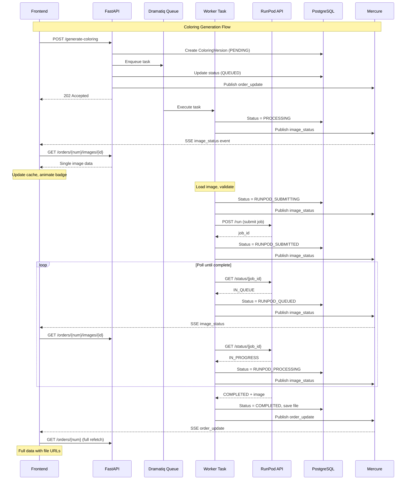

# Separate Processing Status Enums for Coloring and SVG

## Current State

- Single `ImageProcessingStatus` enum with 5 values: `PENDING`, `QUEUED`, `PROCESSING`, `COMPLETED`, `ERROR`
- Used by both `ColoringVersion` and `SvgVersion` models
- PostgreSQL enum type `imageprocessingstatus` already exists in the database
- API returns `file_path` (local filesystem path) - not suitable for frontend consumption

## Proposed Changes

### 0. Infrastructure: Nginx Static File Server

Add nginx to [docker-compose.yml](docker-compose.yml) to serve static files (images, colorings, SVGs):

```yaml
nginx:
  image: nginx:alpine
  volumes:
    - storage_data:/data:ro
    - ./backend/.docker/nginx/default.conf:/etc/nginx/conf.d/default.conf:ro
  ports:
    - "8081:80"
  healthcheck:
    test: ["CMD", "wget", "-q", "--spider", "http://localhost:80/"]
    interval: 5s
    timeout: 5s
    retries: 5
```

**Nginx config** (`backend/.docker/nginx/default.conf`):

```nginx
server {
    listen 80;
    
    # /static/ serves everything from /data/
    # e.g., /static/images/... → /data/images/...
    location /static/ {
        alias /data/;
        autoindex off;
        
        # Cache static files
        expires 1d;
        add_header Cache-Control "public, immutable";
    }
}
```

**Environment variables** (add to `.env.example`):

```
STATIC_URL=http://localhost:8081/static
```

**Backend config** ([backend/app/config.py](backend/app/config.py)):

```python
# Reads from STATIC_URL env var, with default for local development
static_url: str = "http://localhost:8081/static"
```

Note: This URL is returned in API responses for the browser to fetch files. It must be the external URL accessible from the browser, not an internal docker network URL.

**URL generation** - files stored at `/data/images/42/1/image_123.jpg` become `http://localhost:8081/static/images/42/1/image_123.jpg`

**Frontend config** ([frontend/src/lib/config.ts](frontend/src/lib/config.ts)) - add for reference (though we use `url` from API):

```typescript
export const STATIC_URL = import.meta.env.VITE_STATIC_URL || "http://localhost:8081/static";
```

**docker-compose.yml environment** - add to frontend service:

```yaml
VITE_STATIC_URL: http://localhost:8081/static
```

### 1. Backend Enums ([backend/app/models/enums.py](backend/app/models/enums.py))

Create two new enums with explicit value definitions:

```python
class ColoringProcessingStatus(StrEnum):
    """Status for coloring generation (RunPod)."""
    PENDING = "pending"                      # Not yet queued
    QUEUED = "queued"                        # In Dramatiq queue
    PROCESSING = "processing"                # Dramatiq task started
    RUNPOD_SUBMITTING = "runpod_submitting"  # Submitting to RunPod
    RUNPOD_SUBMITTED = "runpod_submitted"    # RunPod accepted job
    RUNPOD_QUEUED = "runpod_queued"          # RunPod: IN_QUEUE
    RUNPOD_PROCESSING = "runpod_processing"  # RunPod: IN_PROGRESS
    COMPLETED = "completed"
    ERROR = "error"

class SvgProcessingStatus(StrEnum):
    """Status for SVG vectorization (Vectorizer.ai)."""
    PENDING = "pending"
    QUEUED = "queued"
    PROCESSING = "processing"                            # Dramatiq task started
    VECTORIZER_PROCESSING = "vectorizer_processing"      # HTTP request in progress
    COMPLETED = "completed"
    ERROR = "error"
```

### 2. Database Migration

Create migration `004_separate_processing_status_enums.py`:

- Create new PostgreSQL enum `coloringprocessingstatus` with all coloring values
- Create new PostgreSQL enum `svgprocessingstatus` with all SVG values
- Alter `coloring_versions.status` to use new enum (with value mapping)
- Alter `svg_versions.status` to use new enum (with value mapping)
- Drop old `imageprocessingstatus` enum

Value mapping for existing data:

- `pending` -> `pending`
- `queued` -> `queued`
- `processing` -> `processing` (keep as-is, maps to new PROCESSING status)
- `completed` -> `completed`
- `error` -> `error`

### 3. Model Updates ([backend/app/models/coloring.py](backend/app/models/coloring.py))

- Change `ColoringVersion.status` type from `ImageProcessingStatus` to `ColoringProcessingStatus`
- Change `SvgVersion.status` type from `ImageProcessingStatus` to `SvgProcessingStatus`
- Update PostgreSQL enum type definitions for each

### 4. Task Updates

**[backend/app/tasks/process/generate_coloring.py](backend/app/tasks/process/generate_coloring.py)**:

Update status flow (each step triggers Mercure update):

1. Dramatiq task starts -> `PROCESSING` (immediately, before loading image/DB)
2. Before calling RunPod -> `RUNPOD_SUBMITTING`
3. After `submit_job()` returns job_id -> `RUNPOD_SUBMITTED`
4. Poll returns `IN_QUEUE` -> `RUNPOD_QUEUED`
5. Poll returns `IN_PROGRESS` -> `RUNPOD_PROCESSING`
6. Poll returns `COMPLETED` -> `COMPLETED`
7. On error -> `ERROR`

**[backend/app/services/runpod.py](backend/app/services/runpod.py)**:

Modify `poll_job()` to accept an optional async callback for status changes:

```python
async def poll_job(
    job_id: str,
    on_status_change: Callable[[str], Awaitable[None]] | None = None,
) -> bytes:
```

The callback is invoked when RunPod status changes (IN_QUEUE, IN_PROGRESS), allowing the task to update DB and trigger Mercure.

**[backend/app/tasks/process/vectorize_image.py](backend/app/tasks/process/vectorize_image.py)**:

Update to use `SvgProcessingStatus`:

1. Dramatiq task starts -> `PROCESSING` (+ Mercure)
2. Before HTTP request -> `VECTORIZER_PROCESSING` (+ Mercure)
3. Success -> `COMPLETED` (+ Mercure)
4. Failure -> `ERROR` (+ Mercure)

### 4a. File Path Structure

Update file storage paths to use organized directory structure:

**Path format:**

```
<storage_path>/<order_id>/<line_item_id>/[coloring|svg]/v<version>/image_<position>.<suffix>
```

**Examples:**

```
/data/images/92/121/image_1.jpg           # Source image
/data/images/92/121/coloring/v1/image_1.png   # Coloring version 1
/data/images/92/121/coloring/v2/image_1.png   # Coloring version 2
/data/images/92/121/svg/v1/image_1.svg        # SVG version 1
```

**Path generation helpers** (update in tasks):

```python
def _get_coloring_path(order_id: int, line_item_id: int, position: int, version: int) -> Path:
    """Generate storage path for a coloring version."""
    base = Path(settings.storage_path)
    return base / str(order_id) / str(line_item_id) / "coloring" / f"v{version}" / f"image_{position}.png"

def _get_svg_path(order_id: int, line_item_id: int, position: int, version: int) -> Path:
    """Generate storage path for an SVG version."""
    base = Path(settings.storage_path)
    return base / str(order_id) / str(line_item_id) / "svg" / f"v{version}" / f"image_{position}.svg"
```

**Directory creation and file I/O** - use async file operations consistently:

```python
import anyio

# Create directory (async)
await anyio.Path(output_path.parent).mkdir(parents=True, exist_ok=True)

# Write file (async)
await anyio.Path(output_path).write_bytes(result_data)
```

Note: Use `anyio.Path` for async file I/O to avoid blocking the event loop. The vectorizer service already uses this pattern.

**Files affected:**

- [backend/app/tasks/process/generate_coloring.py](backend/app/tasks/process/generate_coloring.py) - update `_get_coloring_path()`
- [backend/app/tasks/process/vectorize_image.py](backend/app/tasks/process/vectorize_image.py) - update `_get_svg_path()`
- [backend/app/tasks/image_download.py](backend/app/tasks/image_download.py) - update source image path if needed

### 5. API Updates ([backend/app/api/v1/orders.py](backend/app/api/v1/orders.py))

Update all references from `ImageProcessingStatus` to the appropriate enum:

- Coloring-related code uses `ColoringProcessingStatus`
- SVG-related code uses `SvgProcessingStatus`

---

## Complete API Endpoint Changes

### Endpoints to REMOVE (nginx serves static files instead):

| Current Endpoint | Purpose | Replacement |

|-----------------|---------|-------------|

| `GET /api/v1/images/{image_id}` | Serve downloaded image | `url` in API response → nginx |

| `GET /api/v1/coloring-versions/{version_id}/file` | Serve coloring PNG | `url` in API response → nginx |

| `GET /api/v1/svg-versions/{version_id}/file` | Serve SVG file | `url` in API response → nginx |

### Endpoints to KEEP (but restructure responses):

| Endpoint | Changes |

|----------|---------|

| `GET /api/v1/orders/{order_number}` | Response: `images[].versions.{coloring,svg}`, `url` |

| `POST /api/v1/orders/{order_number}/generate-coloring` | No change to endpoint, response uses new schema |

| `POST /api/v1/orders/{order_number}/generate-svg` | No change to endpoint, response uses new schema |

| `POST /api/v1/images/{image_id}/generate-coloring` | Keep endpoint, response uses new schema |

| `POST /api/v1/images/{image_id}/generate-svg` | Keep endpoint, response uses new schema |

| `GET /api/v1/images/{image_id}/coloring-versions` | Response uses new schema with `options` |

| `GET /api/v1/images/{image_id}/svg-versions` | Response uses new schema with `options` |

| `POST /api/v1/images/{image_id}/select-coloring/{version_id}` | No change |

| `POST /api/v1/images/{image_id}/select-svg/{version_id}` | No change |

| `POST /api/v1/coloring-versions/{version_id}/retry` | Response uses new schema |

| `POST /api/v1/svg-versions/{version_id}/retry` | Response uses new schema |

### New Endpoints:

| Endpoint | Purpose |

|----------|---------|

| `GET /api/v1/orders/{order_number}/images/{image_id}` | Fetch single image data (for efficient Mercure updates) |

---

## Frontend API Changes ([frontend/src/lib/api.ts](frontend/src/lib/api.ts))

### Functions to REMOVE:

```typescript
// Remove - images served by nginx via url field
export function getImageUrl(imageId: number): string;
export function getColoringVersionUrl(versionId: number): string;
export function getSvgVersionUrl(versionId: number): string;
```

### Functions to ADD:

```typescript
// Fetch single image data (for Mercure image_status handling)
export async function fetchImage(orderNumber: string, imageId: number): Promise<OrderImage>;
```

### TypeScript Interfaces to UPDATE:

```typescript
// OLD
interface OrderImage {
  local_path: string | null;
  coloring_versions: ColoringVersion[];
}
interface ColoringVersion {
  file_path: string | null;
  megapixels: number;
  steps: number;
  svg_versions: SvgVersion[];
}
interface SvgVersion {
  file_path: string | null;
  shape_stacking: string;
  group_by: string;
}

// NEW
interface OrderImage {
  url: string | null;  // Direct URL to nginx
  versions: {
    coloring: ColoringVersion[];
    svg: SvgVersion[];
  };
}
interface ColoringVersion {
  url: string | null;  // Direct URL to nginx
  options: {
    megapixels: number;
    steps: number;
  };
  // No svg_versions - they're in versions.svg now
}
interface SvgVersion {
  url: string | null;  // Direct URL to nginx
  options: {
    shape_stacking: string;
    group_by: string;
  };
}
```

---

## Frontend Component Changes ([frontend/src/pages/OrderDetail.tsx](frontend/src/pages/OrderDetail.tsx))

### URL Usage Changes:

```typescript
// OLD


// NEW - use url directly from API response


```

### Data Access Changes:

```typescript
// OLD
image.coloring_versions.forEach(cv => {
  cv.megapixels;
  cv.svg_versions.forEach(sv => { ... });
});

// NEW
image.versions.coloring.forEach(cv => {
  cv.options.megapixels;
});
image.versions.svg.forEach(sv => {
  // Access directly, use coloring_version_id to link
});
```

---

### 5a. New Single Image Endpoint

Add new endpoint to fetch a single image's data:

```python
@router.get("/orders/{order_number}/images/{image_id}")
async def get_image(order_number: str, image_id: int, session: AsyncSession = Depends(get_session)) -> ImageResponse:
    """Get single image with all coloring/SVG versions."""
```

**Response payload** - restructured with `versions.coloring` and `versions.svg`:

```json
{
  "id": 123,
  "position": 1,
  "url": "http://localhost:8081/static/images/42/121/image_1.jpg",
  "downloaded_at": "2026-01-16T14:30:00+01:00",
  "selected_version_ids": {
    "coloring": 456,
    "svg": 789
  },
  "versions": {
    "coloring": [
      {
        "id": 456,
        "version": 1,
        "url": "http://localhost:8081/static/images/42/121/coloring/v1/image_1.png",
        "status": "completed",
        "options": {
          "megapixels": 1.0,
          "steps": 4
        },
        "created_at": "2026-01-16T14:31:00+01:00"
      },
      {
        "id": 457,
        "version": 2,
        "url": null,
        "status": "runpod_processing",
        "options": {
          "megapixels": 2.0,
          "steps": 8
        },
        "created_at": "2026-01-16T14:35:00+01:00"
      }
    ],
    "svg": [
      {
        "id": 789,
        "version": 1,
        "url": "http://localhost:8081/static/images/42/121/svg/v1/image_1.svg",
        "status": "completed",
        "coloring_version_id": 456,
        "options": {
          "shape_stacking": "stacked",
          "group_by": "color"
        },
        "created_at": "2026-01-16T14:32:00+01:00"
      }
    ]
  }
}
```

**Key changes from current API:**

- Remove `original_url` from ImageResponse
- `local_path` / `file_path` → `url` (full URL served by nginx)
- `coloring_versions[].svg_versions` → `versions.svg` (flat structure, linked via `coloring_version_id`)
- `megapixels`, `steps` → `options.megapixels`, `options.steps`
- `shape_stacking`, `group_by` → `options.shape_stacking`, `options.group_by`
- `selected_coloring_id`, `selected_svg_id` → `selected_version_ids: {coloring, svg}`

**Pydantic schemas:**

```python
class ColoringOptionsResponse(BaseModel):
    megapixels: float
    steps: int

class SvgOptionsResponse(BaseModel):
    shape_stacking: str
    group_by: str

class ColoringVersionResponse(BaseModel):
    id: int
    version: int
    url: str | None
    status: ColoringProcessingStatus
    options: ColoringOptionsResponse
    created_at: datetime

class SvgVersionResponse(BaseModel):
    id: int
    version: int
    url: str | None
    status: SvgProcessingStatus
    coloring_version_id: int
    options: SvgOptionsResponse
    created_at: datetime

class VersionsResponse(BaseModel):
    coloring: list[ColoringVersionResponse]
    svg: list[SvgVersionResponse]

class SelectedVersionIdsResponse(BaseModel):
    coloring: int | None
    svg: int | None

class ImageResponse(BaseModel):
    id: int
    position: int
    url: str | None  # Downloaded image URL (served by nginx)
    downloaded_at: datetime | None
    selected_version_ids: SelectedVersionIdsResponse
    versions: VersionsResponse
```

**URL generation helper** ([backend/app/utils/url_helpers.py](backend/app/utils/url_helpers.py)):

```python
from app.config import settings

def file_path_to_url(file_path: str | None) -> str | None:
    """Convert local file path to public URL."""
    if not file_path:
        return None
    # file_path: /data/images/42/1/image.jpg
    # static_url: http://localhost:8081/static
    # result: http://localhost:8081/static/images/42/1/image.jpg
    # 
    # The path starts with /data/, nginx serves /data/* at /static/*
    relative_path = file_path.removeprefix("/data/")
    return f"{settings.static_url}/{relative_path}"
```

### 5b. Mercure Event Enhancements ([backend/app/services/mercure.py](backend/app/services/mercure.py))

Add new function for granular image status updates:

```python
async def publish_image_status(
    order_number: str,
    image_id: int,
    status_type: Literal["coloring", "svg"],
    version_id: int,
    status: str,
) -> None:
    """Publish granular status update for a specific image."""
```

---

## Complete Mercure Event Reference

### Topics

- `orders` - All order-related events (subscribed by order list page)
- `orders/{order_number}` - Events for specific order (subscribed by order detail page)

---

### Event Type 1: `list_update`

Sent when the order list changes. Triggers full list refetch.

**Payload:**

```json
{
  "type": "list_update"
}
```

**Topic:** `orders`

**When sent:**

- New order ingested from webhook
- Order deleted (future feature)

**Frontend action:** Invalidate order list query, refetch `/api/v1/orders`

---

### Event Type 2: `order_update`

Sent when order data changes structurally. Triggers full order refetch.

**Payload:**

```json
{
  "type": "order_update",
  "order_number": "1270"
}
```

**Topics:** `orders`, `orders/{order_number}`

**When sent:**

- New coloring/SVG version created (status goes PENDING → QUEUED)
- Processing completed successfully (status → COMPLETED, file_path now available)
- Processing failed (status → ERROR)
- Selected version changed

**Frontend action:** Invalidate order query, refetch `/api/v1/orders/{order_number}`

---

### Event Type 3: `image_status` (NEW)

Sent during processing for granular status updates. Triggers single image fetch only.

**Payload:**

```json
{
  "type": "image_status",
  "order_number": "1270",
  "image_id": 123,
  "status_type": "coloring",
  "version_id": 456,
  "status": "runpod_processing"
}
```

**Topics:** `orders`, `orders/{order_number}`

**Fields:**

- `order_number` (string) - Shopify order number without "#"
- `image_id` (number) - Database ID of the Image record
- `status_type` (string) - Either `"coloring"` or `"svg"`
- `version_id` (number) - Database ID of ColoringVersion or SvgVersion
- `status` (string) - New status value

**Coloring status values sent via `image_status`:**

- `processing` - Dramatiq task started
- `runpod_submitting` - About to call RunPod API
- `runpod_submitted` - RunPod returned job ID
- `runpod_queued` - RunPod reports IN_QUEUE
- `runpod_processing` - RunPod reports IN_PROGRESS

**SVG status values sent via `image_status`:**

- `processing` - Dramatiq task started
- `vectorizer_processing` - Vectorizer.ai HTTP request in progress

**Frontend action:** Fetch `/api/v1/orders/{order_number}/images/{image_id}`, merge into cache

---

### Event Decision Matrix

| Status Transition | Event Type | Reason |

|-------------------|------------|--------|

| (new) → `pending` → `queued` | `order_update` | New version created, need full structure |

| `queued` → `processing` | `image_status` | Status-only, no new data |

| `processing` → `runpod_submitting` | `image_status` | Status-only |

| `runpod_submitting` → `runpod_submitted` | `image_status` | Status-only |

| `runpod_submitted` → `runpod_queued` | `image_status` | Status-only |

| `runpod_queued` → `runpod_processing` | `image_status` | Status-only |

| `runpod_processing` → `completed` | `order_update` | File path now available |

| `*` → `error` | `order_update` | Error details may be needed |

---

### Benefits

- **Efficient updates:** `image_status` events trigger ~1KB fetch instead of ~10-50KB full order
- **Real-time feedback:** Users see each processing step as it happens
- **Multi-user safe:** All clients viewing the order receive updates regardless of who triggered processing

### 6. Frontend Updates ([frontend/src/types/index.ts](frontend/src/types/index.ts))

**TypeScript interfaces** matching new API structure:

```typescript
// Options interfaces
interface ColoringOptions {
  megapixels: number;
  steps: number;
}

interface SvgOptions {
  shape_stacking: string;
  group_by: string;
}

// Version interfaces
interface ColoringVersion {
  id: number;
  version: number;
  url: string | null;
  status: string;
  options: ColoringOptions;
  created_at: string;
}

interface SvgVersion {
  id: number;
  version: number;
  url: string | null;
  status: string;
  coloring_version_id: number;
  options: SvgOptions;
  created_at: string;
}

interface Versions {
  coloring: ColoringVersion[];
  svg: SvgVersion[];
}

interface SelectedVersionIds {
  coloring: number | null;
  svg: number | null;
}

// Image interface
interface Image {
  id: number;
  position: number;
  url: string | null;  // Downloaded image URL (served by nginx)
  downloaded_at: string | null;
  selected_version_ids: SelectedVersionIds;
  versions: Versions;
}
```

**Status display mappings:**

```typescript
export const COLORING_STATUS_DISPLAY: Record<string, { label: string; color: string }> = {
  pending: { label: "Čeká na odeslání", color: "bg-gray-100 text-gray-800" },
  queued: { label: "Čeká ve frontě", color: "bg-blue-100 text-blue-800" },
  processing: { label: "Zpracovává se...", color: "bg-blue-100 text-blue-800" },
  runpod_submitting: { label: "Runpod: odesílání na server", color: "bg-blue-100 text-blue-800" },
  runpod_submitted: { label: "Runpod: úloha přijata", color: "bg-blue-100 text-blue-800" },
  runpod_queued: { label: "Runpod: čeká ve frontě", color: "bg-yellow-100 text-yellow-800" },
  runpod_processing: { label: "Runpod: Probíhá zpracování", color: "bg-yellow-100 text-yellow-800" },
  completed: { label: "Dokončeno", color: "bg-green-100 text-green-800" },
  error: { label: "Chyba", color: "bg-red-100 text-red-800" },
};

export const SVG_STATUS_DISPLAY: Record<string, { label: string; color: string }> = {
  pending: { label: "Čeká na odeslání", color: "bg-gray-100 text-gray-800" },
  queued: { label: "Čeká ve frontě", color: "bg-blue-100 text-blue-800" },
  processing: { label: "Zpracovává se...", color: "bg-blue-100 text-blue-800" },
  vectorizer_processing: { label: "Vectorizer: Probíhá zpracování", color: "bg-yellow-100 text-yellow-800" },
  completed: { label: "Dokončeno", color: "bg-green-100 text-green-800" },
  error: { label: "Chyba", color: "bg-red-100 text-red-800" },
};
```

**Helper functions:**

```typescript
export function getColoringStatusDisplay(status: string | null): { label: string; color: string };
export function getSvgStatusDisplay(status: string | null): { label: string; color: string };
```

### 7. Frontend Component Updates ([frontend/src/pages/OrderDetail.tsx](frontend/src/pages/OrderDetail.tsx))

Update to use new API structure:

- Change `image.coloring_versions` → `image.versions.coloring`
- Change `coloring.svg_versions` → `image.versions.svg` (filter by `coloring_version_id`)
- Remove usage of `image.original_url`
- Change `image.local_path` / `cv.file_path` / `sv.file_path` → `.url` (use directly in ``)
- Change `cv.megapixels` → `cv.options.megapixels`
- Change `sv.shape_stacking` → `sv.options.shape_stacking`
- Change `image.selected_coloring_id` → `image.selected_version_ids.coloring`
- Change `image.selected_svg_id` → `image.selected_version_ids.svg`
- Use `getColoringStatusDisplay()` for coloring versions
- Use `getSvgStatusDisplay()` for SVG versions

### 7a. Frontend Hook Updates ([frontend/src/hooks/useOrderEvents.ts](frontend/src/hooks/useOrderEvents.ts))

Update to handle `image_status` events efficiently:

```typescript
interface MercureEvent {
  type: "order_update" | "list_update" | "image_status";
  order_number?: string;
  // For image_status events:
  image_id?: number;
  status_type?: "coloring" | "svg";
  version_id?: number;
  status?: string;
}
```

**Hook logic:**

```typescript
eventSource.onmessage = async (event) => {
  const data: MercureEvent = JSON.parse(event.data);
  
  if (data.type === "image_status" && data.image_id) {
    // Fetch only the updated image
    const imageData = await fetch(`/api/v1/orders/${orderNumber}/images/${data.image_id}`);
    
    // Update local cache - replace just this image in the order data
    queryClient.setQueryData(["order", orderNumber], (old) => ({
      ...old,
      images: old.images.map((img) => 
        img.id === data.image_id ? imageData : img
      ),
    }));
  } else if (data.type === "order_update") {
    // Full refetch for structural changes
    queryClient.invalidateQueries(["order", orderNumber]);
  }
};
```

This ensures:

- Frequent status updates (every few seconds during processing) only fetch ~1KB instead of full order
- Structural changes still trigger full refetch to get new entities/file URLs

### 8. CSS Transitions for Status Badges

Add smooth transitions for status badge updates in [frontend/src/index.css](frontend/src/index.css) or inline:

```css
/* Status badge transition - smooth color and content changes */
.status-badge {
  @apply transition-all duration-300 ease-in-out;
}
```

The status badge component should:

- Use `transition-colors` and `transition-opacity` for smooth color changes
- Optionally add a subtle pulse/glow animation when status changes to draw attention
- Example implementation:
```tsx
<span 
  className={cn(
    "inline-flex items-center rounded-full px-2.5 py-0.5 text-xs font-medium",
    "transition-all duration-300 ease-in-out",
    status.color
  )}
>
  {status.label}
</span>
```


For more noticeable transitions, consider a brief highlight effect when status changes using React state or CSS keyframes.

## Data Flow Diagram



**Event Types Summary:**

- `image_status` - Lightweight updates during processing, triggers single image fetch (~1KB)
- `order_update` - Structural changes (COMPLETED, ERROR, new version), triggers full order refetch

---

## Documentation Updates

### Root README.md Changes

Update [README.md](README.md):

- **Remove:** "Project Structure" section (lines 89-112)
- **Add:** Links to frontend and backend READMEs
- **Update:** Real-time Updates section to reflect new `image_status` events
```markdown
## Documentation

- [Backend Documentation](backend/README.md) - FastAPI, database models, background tasks, API reference
- [Frontend Documentation](frontend/README.md) - React app, components, hooks, state management
```


### Create backend/README.md

Create [backend/README.md](backend/README.md) with:

- Project structure for backend
- Database models overview
- API endpoints reference (new structure with `versions.{coloring,svg}`)
- Background tasks (Dramatiq)
- Processing status enums (ColoringProcessingStatus, SvgProcessingStatus)
- Mercure events reference
- Available scripts (`uv run codegen`, `uv run alembic`, etc.)
- Environment variables

### Create frontend/README.md

Create [frontend/README.md](frontend/README.md) with:

- Project structure for frontend
- Component overview
- Hooks (useMercure, useOrderEvents, useOrderListEvents)
- API client (`lib/api.ts`)
- TypeScript types and interfaces
- Status display mappings (COLORING_STATUS_DISPLAY, SVG_STATUS_DISPLAY)
- Available scripts (`npm run dev`, `npm run check`, etc.)
- Environment variables